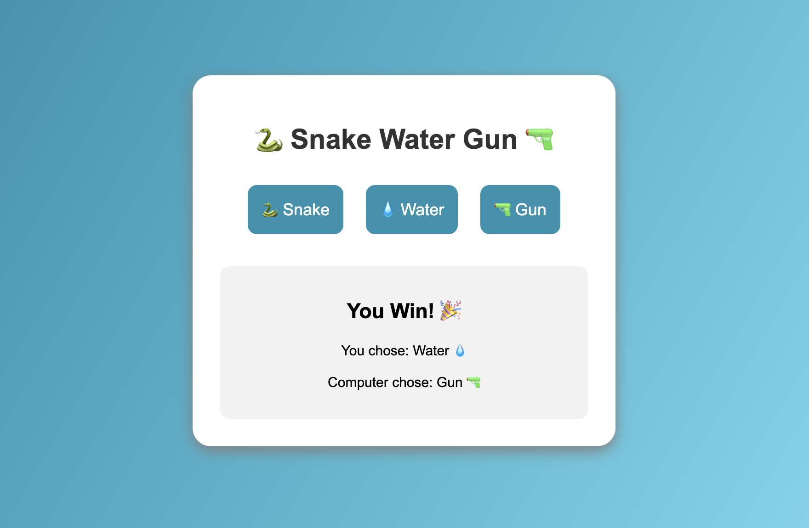

# 🐍 Snake Water Gun Game 🔫

A web-based Snake Water Gun game built using **Python Flask, HTML, and CSS**.  
The game allows users to choose Snake, Water, or Gun and compete against the computer with randomly generated choices.

---

## 🎮 About The Project

Snake Water Gun is a simple game inspired by Rock Paper Scissors.

Game Rules:

- 🐍 Snake drinks Water → Snake wins
- 🔫 Gun kills Snake → Gun wins
- 💧 Water damages Gun → Water wins

The computer randomly selects one option and the winner is decided based on the game rules.

---

## 🚀 Features

- Interactive web-based interface
- User vs Computer gameplay
- Random computer choices
- Instant result display
- Simple and responsive UI
- Built using Flask backend

---

## 🛠️ Tech Stack

- Python
- Flask
- HTML5
- CSS3

---

## Screenshot

## Author

**Kanika Sharma**